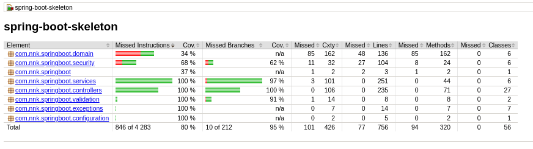

# spring-boot-skeleton

## Setup before first launch of application
---
Before running application for the first time, we have to create database to have at least a user 'admin' for logging:

 1. Create a database with name "demo" as configuration in `application-dev-properties`
 2. run the sql script, to create table and insert data, located in `setup/data.sql` 
   
After that, we can run the application as usual.

---
## Running the application locally
---
There are several ways to run application on your local machine. One way is to execute the main method in the com.nnk.springboot.Application.java from your favorite IDE.

Alternatively you can use the Spring Boot Maven plugin like so:
```shell
mvn spring-boot:run
```
---
## Login 
---

* ### <u>Login with credential</u>


Since application is running, from the HOME PAGE , you can log in with credential by clicking link:

***"Login"*** or ***"User management"***

The Login page is shown, and you can log in with:
* username: `admin`
* passwd: `Admin4&verPoseidon`

Thus, your are admin and can add other user !

* ### <u>Login with Github</u>
  

From login page ,if you have a github account, you can also log in with OAuth2 by clicking the link:

***"Login with Github"***

---
## Technical:
---
This application was upgraded 'cause of some jars for examle for hibernate's validation not compatibles. Now this application uses:
1. Framework: Spring Boot v2.7.6
2. Framework: SpringSecurity
3. Java 8
4. Thymeleaf
5. Bootstrap v.4.3.1
6. Log4j2 v2.17.1
7. Junit4 v.5.9.1
8. Jacoco v.0.8.7
9. Mysql & H2 db

---
## Run test
---
We used TDD to implement code in this project:

So, from creation of integration and unit tests, we created the source's code and check it to be sure of its correct working.

As we need a database for integration tests with test-cases,we use a H2 database without any configuration.


* To run unit tests only, you can use command: 
    ```shell
    mvn test
    ```

* To run integration tests only, you can use command:
    ```shell
   mvn failsafe:integration-test
    ```
* If you want to launch a build phase without integration tests, you can use next option for example:  
  ```shell
    mvn verify -Dskip.it=true
    ```

---
## Jacoco Coverage
---

A report of coverage is automatically done when you launch tests.
<p align="center" width="90%">

</p>

You can access to it at location :

* For a report of unit tests : `target/site/jacoco/index.html`  after launch `mvn test`

* For a report of integration tests : `target/site/jacoco-it/index.html`  after launch `mvn verify jacoco:report-integration`

---
## Versions
---
* V0.1.0 :
    * Fork and Clone project in locale
    * Upgrade application to resolve problem of dependencie's jar
    * Implementation of all models with constructors to resolve problems of errors
    * Implementation of service, controller and view for BidList using TDD
* V0.2.0:
    * Implementation of all services,controllers and views for all entities using TDD
    * Add Jacoco plugin to have report for tests
    * Clean code and update pom.xml
* V1.0.0:
    * Configuration of SpringSecurity for the application
    * 2 types of Login :
        * `One with credential`
        * `Another with Oauht2Authentication with Github`
    * Check and Control access to endpoints in function of Role `ADMIN` or `USER` of user
    * Tests for login to application : OK
    * Add custom validator for password and quantity for entities
    * Refactoring of UT & IT 
    * Remplacement mysql database 'test by H2 database to not have any configuration to do before launch test

